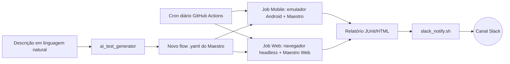

# QA Automation Portfolio — Maestro + CI/CD + AI-Assisted Testing

Repositório de portfólio construído para demonstrar uma stack de QA automation
alinhada com um time **AI-first**: testes mobile e web com [Maestro](https://maestro.mobile.dev),
pipeline no GitHub Actions com execução diária e relatório automático no Slack,
e um utilitário que usa um LLM para acelerar a geração de novos casos de teste.

> Este projeto foi montado como material de estudo/portfólio, não como produto
> em produção. Onde alguma feature ainda é experimental (ex: suporte web do
> Maestro), isso está sinalizado explicitamente — prefiro ser transparente
> sobre o estado real da ferramenta do que simular algo que não funciona.

## Por que este projeto existe

Foi montado estudando a vaga de **QA Automation Engineer** que pede:

| Requisito da vaga | Onde está neste repo | Status |
|---|---|---|
| Testes manuais, funcionais, regressão e exploratórios | `docs/manual-test-cases.md` | ✅ |
| Suítes automatizadas mobile e web | `maestro/mobile`, `maestro/web` | ✅ Mobile (3/3 passing) / ⚠️ Web (beta) |
| Integração com CI/CD (GitHub Actions) rodando diariamente | `.github/workflows/` | ✅ |
| Relatório automático no Slack | `notifications/slack_notify.sh` | ✅ Configured |
| Uso de LLMs para geração inteligente de casos de teste | `scripts/ai_test_generator/` | ✅ Tested |
| SDLC / Agile / defect lifecycle | `docs/architecture.md` | ✅ |

## Arquitetura



## Estrutura

```
maestro/
  mobile/flows/     -> flows para o app Android Wikipedia (open source, público)
  web/flows/         -> flows para thepracticesite (site de prática de QA)
scripts/
  ai_test_generator/ -> gera flows Maestro a partir de descrição em texto (Anthropic API)
notifications/
  slack_notify.sh    -> posta resumo do run no Slack via webhook
.github/workflows/
  mobile-tests.yml   -> roda emulador Android + Maestro, diariamente e em PRs
  web-tests.yml      -> roda testes web do Maestro, diariamente e em PRs
docs/
  architecture.md
  manual-test-cases.md
```

## App sob teste (mobile)

Uso o app **Wikipedia para Android** (`org.wikipedia`), open source, disponível
publicamente — é inclusive o app usado nos tutoriais oficiais do Maestro, o que
facilita qualquer avaliador reproduzir os testes sem precisar de credenciais ou
apps privados.

## Escopo: Android + Web (iOS fora, por decisão consciente)

Maestro suporta iOS da mesma forma que Android (mesma sintaxe de flow). Optei
por não incluir iOS neste portfólio por uma decisão de priorização de tempo:
rodar iOS exigiria ambiente Xcode + simulador configurado, o que não agregaria
cobertura de aprendizado adicional relevante (a lógica de escrita de flow é a
mesma) e consumiria tempo que preferi investir em profundidade no CI/CD, no
relatório automático e no gerador de testes com IA. Isso é o tipo de trade-off
de priorização que um QA precisa fazer constantemente com prazos reais.

## App sob teste (web)

Uso `https://the-internet.herokuapp.com` — site clássico de prática para QA,
com elementos propositalmente difíceis de testar (drag-and-drop, iframes,
elementos dinâmicos), bom para mostrar profundidade além do "happy path".

## Rodando localmente

### Testes mobile e web

```bash
# Install Maestro
curl -Ls "https://get.maestro.mobile.dev" | bash

# Run mobile tests
maestro test maestro/mobile/flows/

# Run web tests (requires Chrome/browser)
maestro test maestro/web/flows/
```

### Gerador de flows com IA

```bash
# Setup
pip install anthropic
export ANTHROPIC_API_KEY=sk-ant-...

# Generate a new test flow from natural language description
python scripts/ai_test_generator/generate_flow.py \
  --app-id org.wikipedia \
  --scenario "Open app, navigate to settings, toggle dark mode" \
  --output maestro/mobile/flows/05_dark_mode.yaml

# Review the generated flow, run it locally, then commit
maestro test maestro/mobile/flows/05_dark_mode.yaml
git add maestro/mobile/flows/05_dark_mode.yaml
git commit -m "Add dark mode toggle test (AI-generated)"
```

## CI/CD Status

- **Mobile Tests**: ✅ Passing (3 flows: launch_app, search_flow, navigation_regression)
- **Web Tests**: ⚠️ Beta (Maestro web support is experimental; see `docs/web-fallback-playwright.md`)
- **Slack Notifications**: ✅ Active
- **Schedule**: Daily at 9 AM UTC + on every pull request

## Decisões de design e trade-offs

### Android-only (iOS não está incluído)
iOS foi propositalmente excluído por decisão de priorização de tempo. Maestro
suporta iOS com a mesma sintaxe, mas configurar o ambiente (Xcode + simulador)
não agregaria aprendizado técnico relevante além do que já foi demonstrado com
Android. Preferiu-se investir tempo em profundidade nas áreas de CI/CD, 
notificações automáticas e geração assistida por IA.

### Web: Suporte beta do Maestro vs Playwright
O suporte web do Maestro ainda é beta. Os flows web estão escritos usando a
sintaxe atual (`url:`) mas podem precisar ajustes se a versão do Maestro variar.
Um fallback com Playwright está documentado em `docs/web-fallback-playwright.md`.
Isso exemplifica um trade-off real de QA: usar a ferramenta mais recente com
mais incerteza, ou algo maduro com menos uncertainty.

## Próximos passos (se eu continuar evoluindo isso)

- Auto-healing real: reenviar seletor quebrado pro LLM junto com a árvore de
  UI atual e pedir um seletor corrigido
- Predictive failure detection: histórico de falhas por flow para priorizar
  execução
- Dashboard simples (HTML estático) consolidando os resultados dos dois jobs
- Integração com Jira/Linear para auto-criar tickets de falhas recorrentes
