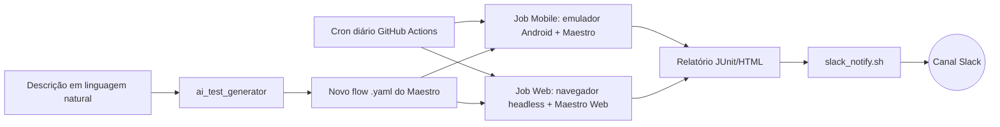

# QA Automation Portfolio — Maestro + CI/CD + AI-Assisted Testing

Repositório de portfólio construído para demonstrar uma stack de QA automation
alinhada com um time **AI-first**: testes mobile e web com [Maestro](https://maestro.mobile.dev),
pipeline no GitHub Actions com execução diária e relatório automático no Slack,
e um utilitário que usa um LLM para acelerar a geração de novos casos de teste.

> Este projeto foi montado como material de estudo/portfólio, não como produto
> em produção. Onde alguma feature ainda é experimental (ex: suporte web do
> Maestro), isso está sinalizado explicitamente — prefiro ser transparente
> sobre o estado real da ferramenta do que simular algo que não funciona.

## Por que este projeto existe

Foi montado estudando a vaga de **QA Automation Engineer** que pede:

| Requisito da vaga | Onde está neste repo |
|---|---|
| Testes manuais, funcionais, regressão e exploratórios | `docs/manual-test-cases.md` |
| Suítes automatizadas mobile e web | `maestro/mobile`, `maestro/web` |
| Integração com CI/CD (GitHub Actions) rodando diariamente | `.github/workflows/` |
| Relatório automático no Slack | `notifications/slack_notify.sh` |
| Uso de LLMs para geração inteligente de casos de teste | `scripts/ai_test_generator/` |
| SDLC / Agile / defect lifecycle | `docs/architecture.md` |

## Arquitetura



## Estrutura

```
maestro/
  mobile/flows/     -> flows para o app Android Wikipedia (open source, público)
  web/flows/         -> flows para thepracticesite (site de prática de QA)
scripts/
  ai_test_generator/ -> gera flows Maestro a partir de descrição em texto (Anthropic API)
notifications/
  slack_notify.sh    -> posta resumo do run no Slack via webhook
.github/workflows/
  mobile-tests.yml   -> roda emulador Android + Maestro, diariamente e em PRs
  web-tests.yml      -> roda testes web do Maestro, diariamente e em PRs
docs/
  architecture.md
  manual-test-cases.md
```

## App sob teste (mobile)

Uso o app **Wikipedia para Android** (`org.wikipedia`), open source, disponível
publicamente — é inclusive o app usado nos tutoriais oficiais do Maestro, o que
facilita qualquer avaliador reproduzir os testes sem precisar de credenciais ou
apps privados.

## App sob teste (web)

Uso `https://the-internet.herokuapp.com` — site clássico de prática para QA,
com elementos propositalmente difíceis de testar (drag-and-drop, iframes,
elementos dinâmicos), bom para mostrar profundidade além do "happy path".

## Rodando localmente

```bash
curl -Ls "https://get.maestro.mobile.dev" | bash
maestro test maestro/mobile/flows/
```

## Próximos passos (se eu continuar evoluindo isso)

- Auto-healing real: reenviar seletor quebrado pro LLM junto com a árvore de
  UI atual e pedir um seletor corrigido
- Predictive failure detection: histórico de falhas por flow para priorizar
  execução
- Dashboard simples (HTML estático) consolidando os resultados dos dois jobs
