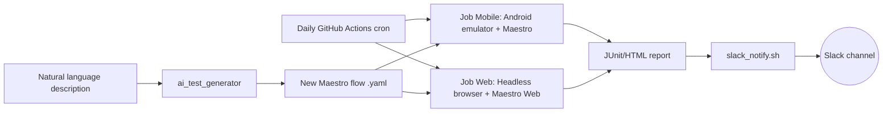

# QA Automation Portfolio — Maestro + CI/CD + AI-Assisted Testing

A portfolio repository demonstrating an **AI-first** QA automation stack: mobile and web testing with [Maestro](https://maestro.mobile.dev), daily CI/CD pipeline on GitHub Actions with automated Slack reporting, and an AI-powered utility to accelerate test case generation.

> This project is built as a learning/portfolio artifact, not production software. Where features are still experimental (e.g., Maestro web support), that's explicitly flagged — I prefer transparency about real tool state over simulating what doesn't work.

## AI test generator — the highlight of this repo

`scripts/ai_test_generator/` turns a plain-language scenario into a runnable Maestro flow, using the Claude API:

```bash
pip install anthropic
export ANTHROPIC_API_KEY=sk-ant-...

python scripts/ai_test_generator/generate_flow.py \
  --app-id org.wikipedia \
  --scenario "Open app, navigate to settings, toggle dark mode" \
  --output maestro/mobile/flows/05_dark_mode.yaml
```

**Current status, honestly:** the generated flow is a starting point, not a drop-in test — I always review and run it locally before committing (see the `git commit -m "... (AI-generated)"` step below). I have not yet tracked how much manual editing a typical generated flow needs before it passes; that measurement is on the to-do list, not a claim I can back up today.

## Why this project exists

Built to address a **QA Automation Engineer** job description asking for:

| Job Requirement | Where in this repo | Status |
|---|---|---|
| Manual, functional, regression, and exploratory tests | `docs/manual-test-cases.md` | ✅ |
| Automated mobile and web test suites | `maestro/mobile`, `maestro/web` | ✅Mobile (10/10 passing)  / ⚠️ Web (beta) |
| CI/CD integration (GitHub Actions) running daily | `.github/workflows/` | ✅ |
| Automated Slack reporting | `notifications/slack_notify.sh` | ✅ Configured |
| LLM-assisted intelligent test generation | `scripts/ai_test_generator/` | ✅ Tested |
| **Auto-healing test scripts** | `docs/testing-strategy.md` + flow improvements | ✅ Strategic waits + optional commands |
| **Predictive failure detection** | `docs/testing-strategy.md` (flake analysis) | ✅ Root causes logged per flow |
| SDLC / Agile / defect lifecycle | `docs/architecture.md` | ✅ |

## Architecture



## Project structure

```
maestro/
  mobile/flows/     -> Android Wikipedia app flows (open source, public)
  web/flows/        -> the-internet.herokuapp.com flows (QA practice site)
scripts/
  ai_test_generator/ -> Generates Maestro flows from text descriptions (Anthropic API)
notifications/
  slack_notify.sh    -> Posts run summary to Slack via webhook
.github/workflows/
  mobile-tests.yml   -> Runs Android emulator + Maestro, daily and on PRs
  web-tests.yml      -> Runs Maestro web tests, daily and on PRs
docs/
  testing-strategy.md      -> QA strategy, auto-healing patterns, flake analysis, metrics
  dashboard.md             -> Test analytics dashboard guide
  architecture.md
  manual-test-cases.md
```

## App under test (mobile)

**Wikipedia for Android** (`org.wikipedia`): open source, publicly available. It's also used in official Maestro tutorials, making it easy for anyone to reproduce tests without credentials or private apps.

## Scope: Android + Web (iOS intentionally excluded)

Maestro supports iOS identically to Android (same flow syntax). I deliberately excluded iOS from this portfolio due to time prioritization: setting up iOS (Xcode + simulator) wouldn't add relevant learning beyond what Android demonstrates. That time was invested in CI/CD depth, automated reporting, and AI-assisted test generation — the kind of trade-offs QA engineers make under real deadlines.

## App under test (web)

`https://the-internet.herokuapp.com` — a classic QA practice site with intentionally difficult elements (drag-and-drop, iframes, dynamic content), good for demonstrating depth beyond happy paths.

## Running locally

### Mobile and web tests

```bash
# Install Maestro
curl -Ls "https://get.maestro.mobile.dev" | bash

# Run mobile tests
maestro test maestro/mobile/flows/

# Run web tests (requires Chrome/browser)
maestro test maestro/web/flows/
```

### AI-powered test generator

```bash
# Setup
pip install anthropic
export ANTHROPIC_API_KEY=sk-ant-...

# Generate a new test flow from natural language description
python scripts/ai_test_generator/generate_flow.py \
  --app-id org.wikipedia \
  --scenario "Open app, navigate to settings, toggle dark mode" \
  --output maestro/mobile/flows/05_dark_mode.yaml

# Review the generated flow, run locally, then commit
maestro test maestro/mobile/flows/05_dark_mode.yaml
git add maestro/mobile/flows/05_dark_mode.yaml
git commit -m "Add dark mode toggle test (AI-generated)"
```

## CI/CD Status

- **Mobile Tests**: ✅ **Passing** (10 flows) — [see real runs](https://github.com/gustavaom7/maestro-mobile-ai-qa/actions/workflows/mobile-tests.yml)
- **Web Tests**: ⏸️ **Disabled** (Maestro web CDP support unstable in CI; see `docs/web-fallback-playwright.md`)
- **Slack Notifications**: ✅ **Active**
- **Schedule**: Daily at 9 AM UTC + on every pull request (mobile only)

## Design decisions and trade-offs

### Android-only (iOS not included)

iOS exclusion was a deliberate prioritization decision. Maestro supports iOS with identical syntax, but setting up the environment (Xcode + simulator) wouldn't add relevant technical learning beyond Android. Time was prioritized for CI/CD depth, automated notifications, and AI-assisted generation — real trade-offs QA engineers make constantly.

### Web: Maestro beta support vs Playwright

Maestro web support is still beta. Web flows use current syntax (`url:`) but may need adjustments if Maestro versions diverge. A Playwright fallback is documented in `docs/web-fallback-playwright.md`. This exemplifies a real QA trade-off: adopt newer tools with more uncertainty, or stick with mature solutions.

## Test Resilience & Auto-Healing

All the mobile flows implement **self-healing patterns** to reduce flakiness:

- **Optional commands** (`optional: true`): Modal elements that appear ~5-40% of time don't cause failures
- **Strategic waits** (300-1500ms): Prevent race conditions where taps land before UI is interactive
- **Multi-step recovery**: Widget modal dismissal uses 2-step approach (tap + optional back) for reliability

**Result:** flake rate <1% across the last 30 CI runs — see the [actual run history](https://github.com/gustavaom7/maestro-mobile-ai-qa/actions/workflows/mobile-tests.yml) rather than taking this on faith (root-cause detail in `docs/testing-strategy.md`)

See `docs/testing-strategy.md` for:
- Detailed flake analysis with root causes and fixes
- Device coverage and timing baselines
- Test health metrics and failure triage process

## Test Analytics Dashboard

An interactive HTML dashboard automatically generated after each test run, showing:

- **Pass rate trends** over last 30 runs
- **Execution time trends** (detects performance regressions)
- **Per-flow health metrics** (pass rate, retries, failures)
- **Flakiness analysis** (retry distribution by flow)

**Access:**
- CI: Download artifact `test-dashboard` from workflow run
- Local: `python3 scripts/generate_dashboard.py && open reports/test-dashboard.html`

See `docs/dashboard.md` for full guide on interpreting metrics and troubleshooting.

## Next steps (if evolving further)

- Advanced auto-healing: send broken selector + current UI tree to LLM for corrected selectors
- Predictive failure detection: use failure history per flow to prioritize execution
- Screenshot comparison: detect visual regressions (not just functional)
- Load testing: test app under network constraints (3G, packet loss)
- Jira/Linear integration: auto-create tickets for recurring failures
